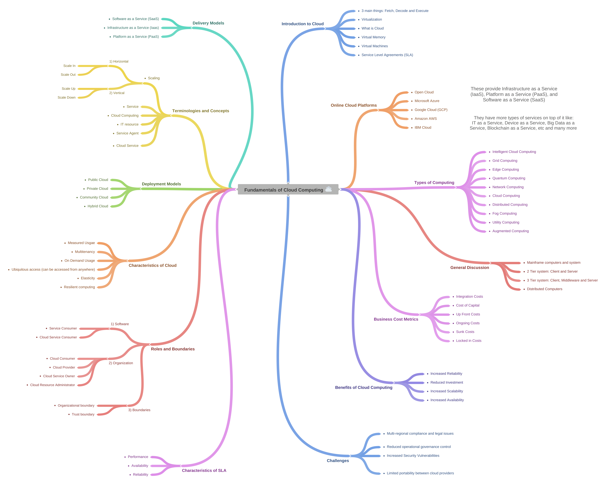
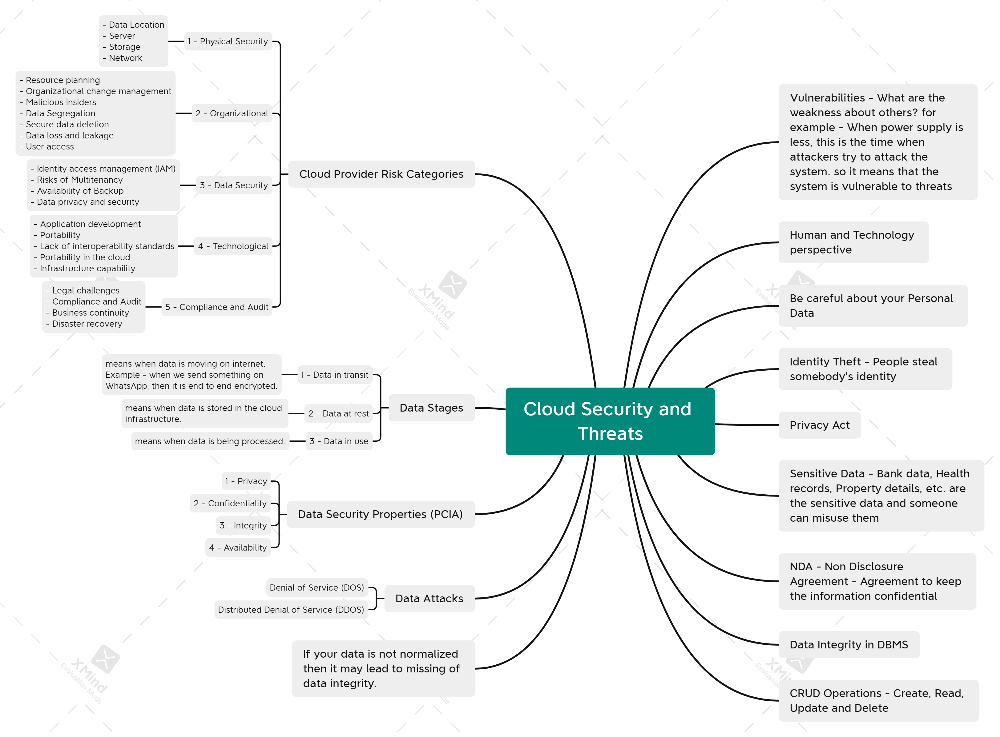
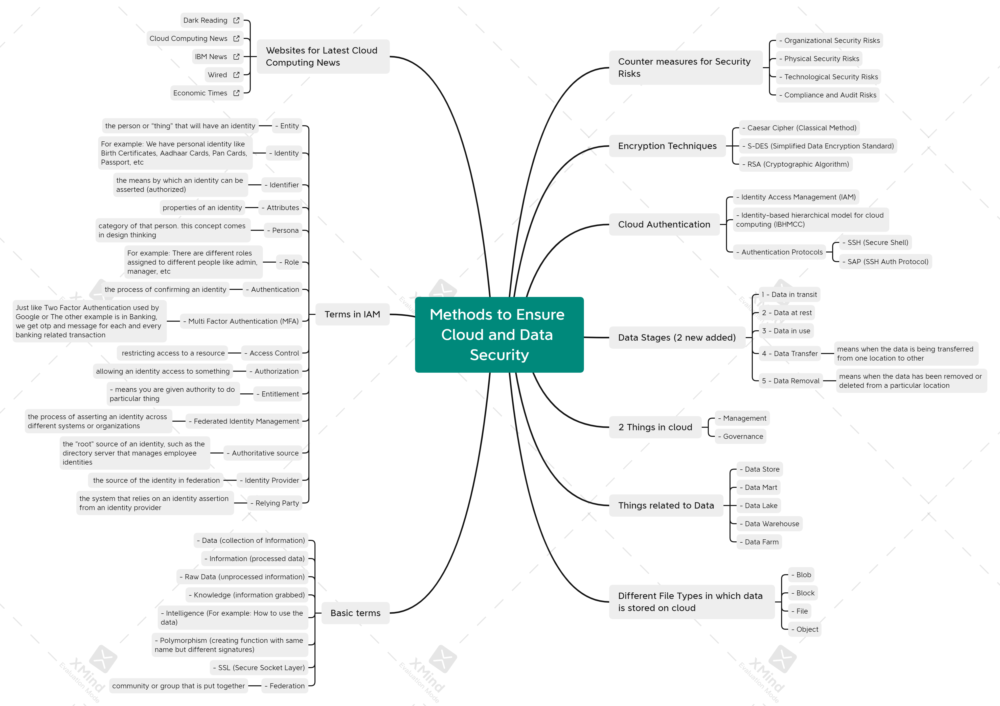
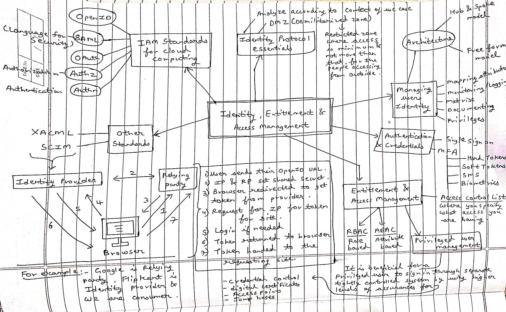
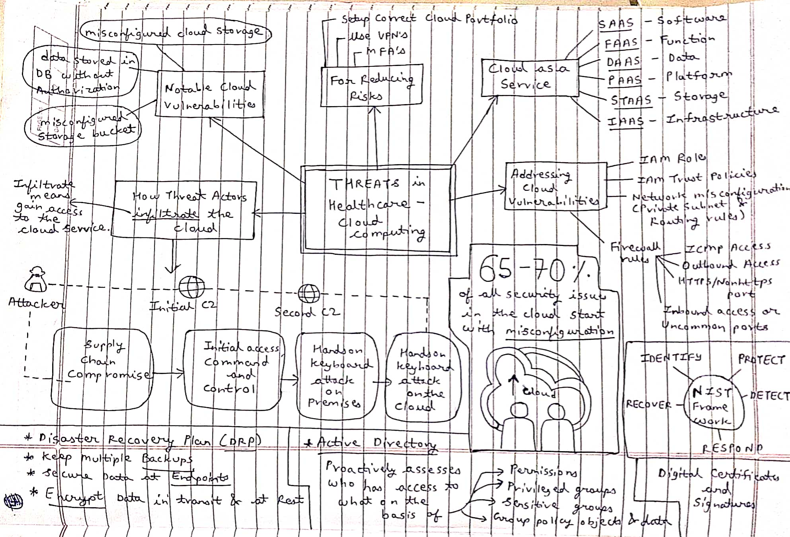
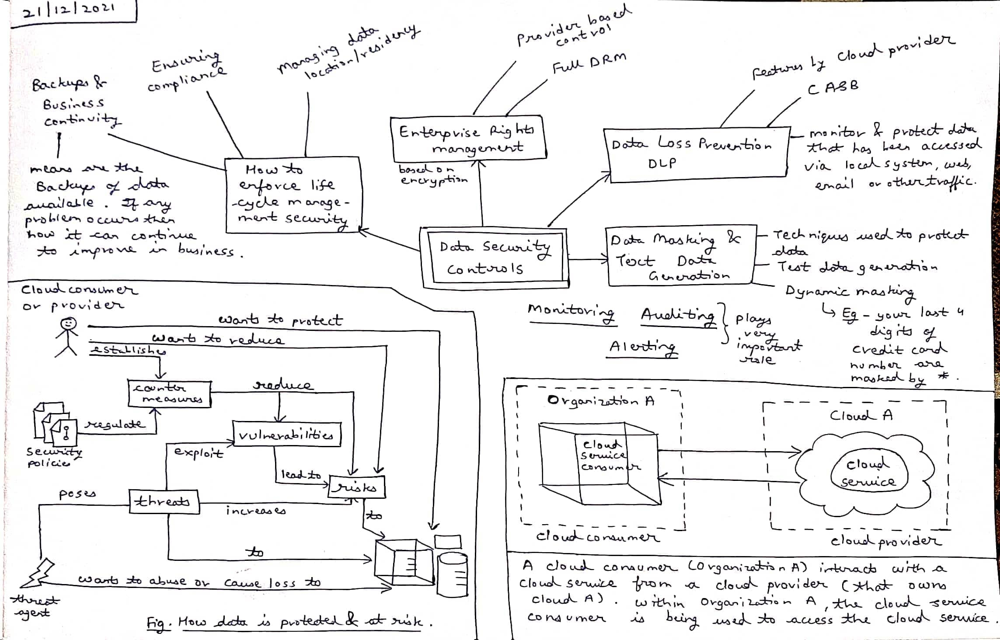
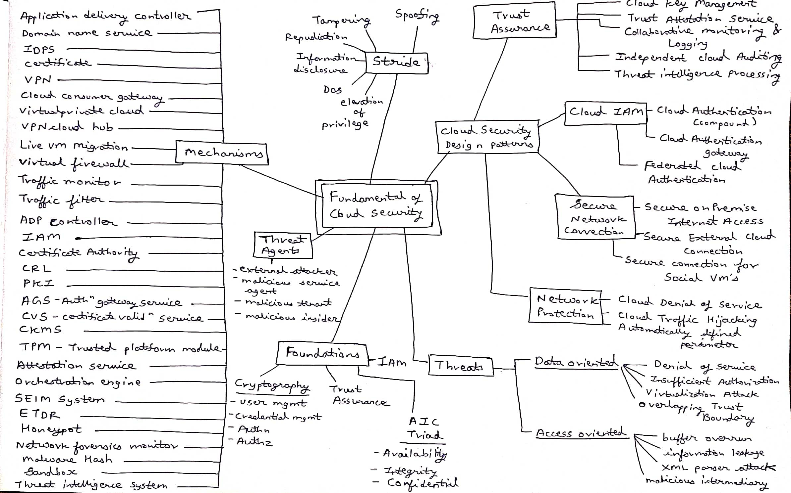

# Cloud Computing and Security Mind-Maps

- 👋 Hello everyone, I am **Prashant Agheda**. I will be sharing the **Mind-maps** for Cloud Computing and Security Lectures on a Daily Basis so keep an eye on this page for further updates.  

# All Mind Maps

## 1) Fundamentals of Cloud Computing (30th October 2021)

-----

## 2) Cloud Security and Threats (10th December 2021)

-----

## 3) Methods to Ensure Cloud and Data Security (13th December 2021)

-----

## 4) Identify, Entitlement and Access Management (16th December 2021)

-----

## 5) Threats in Healthcare Cloud Computing (17 December 2021)

-----

## 6) Data Security Controls (21 December 2021)

-----

## 7) Summary of Fundamentals of Cloud Security (21 December 2021)

-----
